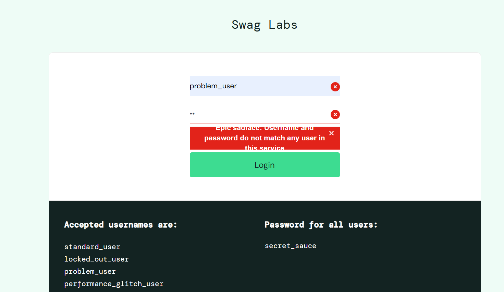

BUG REPORTS

| Subject            | Description                                                                                                                                                                                                               |
|--------------------|---------------------------------------------------------------------------------------------------------------------------------------------------------------------------------------------------------------------------|
| Bug ID             | BUG-001                                                                                                                                                                                                                   |
| Bug Summary        | Cart products added by one user is reflecting in another user cart.                                                                                                                                                       |
| Test Data          | User A : Username:"standard_user" ,Password: "secret_sauce", product1: "Sauce Labs Backpack"  User B:  Username:"problem_user" ,Password: "secret_sauce"                                                       | 
| Steps to Reproduce | 1. Open Google Chrome.  2. Go to https://www.saucedemo.com/ . 3. Login with User A credentials.  4. add product1 to cart 5. click Logout. 6. Login with User B credentials. 7. go to cart and observe. |
| Expected Result    | User B cart should be empty.                                                                                                                                                                                              |
| Actual Result      | User B cart had the product1 which was added by User A.                                                                                                                                                                   |
|Category|Functional Bug|
| Severity           | High                                                                                                                                                                                                                      |
| Priority           | High                                                                                                                                                                                                                      |
| Evidence           | [UserA_Cart_UserB_reflect.mp4](Screenshots/UserA_Cart_UserB_reflect.mp4)                      |

| Subject             | Description                                                                                                                                                         |
|---------------------|---------------------------------------------------------------------------------------------------------------------------------------------------------------------|
| Bug ID              | BUG-002                                                                                                                                                             |
| Bug Summary         | Error message is being overlapped on Login page.                                                                                                                    |
| Test Data           | Username:"standard_user"   Password: "secret"                                                                                                                | 
| Steps to Reproduce  | 1. Open Google Chrome.  2. Go to https://www.saucedemo.com/ . 3. Enter username and Password. 4. Click Login. 5. Observe the 'X' symbol on both Fields. |
| Expected Result     | The Error message should be clearly displayed.                                                                                                                      |
| Actual Result       | The error message has been overlapped. first line and last line is not visually clear.                                                                              |
|Category|UI/UX Bug|
| Severity            | Low                                                                                                                                                                 |
| Priority            | Low                                                                                                                                                                 |
| Evidence Screenshot |                                                                                                              |

| Subject            | Description                                                                                                                                                                |
|--------------------|----------------------------------------------------------------------------------------------------------------------------------------------------------------------------|
| Bug ID             | BUG-003                                                                                                                                                                    |
| Bug Summary        | Verify Sorting option in the inventory page.                                                                                                                               |
| Test Data          | Username:"standard_user"   Password: "secret_sauce"                                                                                                                 | 
| Steps to Reproduce | 1. Open Google Chrome.  2. Go to https://www.saucedemo.com/. 3. Enter username and Password. 4. Click Login. 5. Click on the dropdown arrow on inventory page. |
| Expected Result    | Sorting options should be displayed on dropdown.                                                                                                                           |
| Actual Result      | Nothing happens when clicking dropdown arrow. Though filter icon, and Name(A to Z) sort field is working properly.                                                         |
|Category|UI/UX Bug|
| Severity           | Low                                                                                                                                                                        |
| Priority           | Low                                                                                                                                                                        |
| Evidence Video     |                                                                                                                             |

| Subject            | Description                                                                                                                                                              |
|--------------------|--------------------------------------------------------------------------------------------------------------------------------------------------------------------------|
| Bug ID             | BUG-004                                                                                                                                                                  |
| Bug Summary        | Add to cart is not working for some products of one user.                                                                                                                |
| Test Data          | Username:"problem_user"   Password: "secret_sauce" Product1: "Sauce Labs Bolt T-Shirt"                                                                            | 
| Steps to Reproduce | 1. Open Google Chrome.  2. Go to https://www.saucedemo.com/. 3. Enter username and Password. 4. Click Login. 5. Click add to cart of Product1.               |
| Expected Result    | Product1 should be added into the cart.                                                                                                                                  |
| Actual Result      | Nothing happens when clicking Add to Cart option of product1. This result is reflecting  similarly with following products ["Sauce Labs Fleece Jacket","T-Shirt (Red)"]. |
|Category|Functional Bug|
| Severity           | High                                                                                                                                                                     |
| Priority           | High                                                                                                                                                                     |
| Evidence Video     |                                                                                                                          |

| Subject            | Description                                                                                                                                                                                                                 |
|--------------------|-----------------------------------------------------------------------------------------------------------------------------------------------------------------------------------------------------------------------------|
| Bug ID             | BUG-005                                                                                                                                                                                                                     |
| Bug Summary        | Checkout form is not accepting keyboard keys in lastname field for one user.                                                                                                                                                |
| Test Data          | Username:"problem_user"   Password: "secret_sauce"   Product1: "Sauce Labs Backpack"   First Name: "problem"   Last Name: "user"                                                                              | 
| Steps to Reproduce | 1. Open Google Chrome.  2. Go to https://www.saucedemo.com/. 3. Enter username and Password. 4. Click Login. 5. Add product1 to Cart 6. Go to Cart and click Checkout. 7. Enter First Name and Last Name. |
| Expected Result    | The Form should accept the keys of keyboard for Last Name field.                                                                                                                                                            |
| Actual Result      | The Last Name field is not responding. instead First Name is getting modified with one character which is typed most recently.                                                                                              |
|Category|Functional Bug|
| Severity           | High                                                                                                                                                                                                                        |
| Priority           | High                                                                                                                                                                                                                        |
| Evidence Video     |                                                                                                                                                                              |